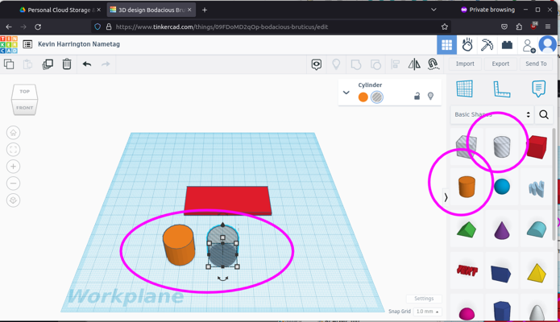
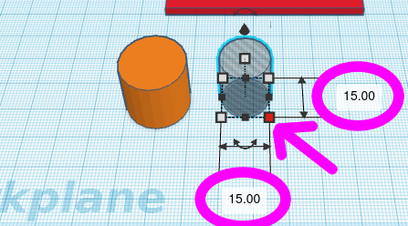
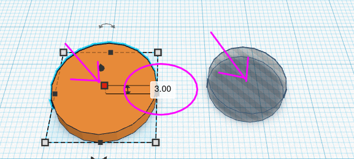
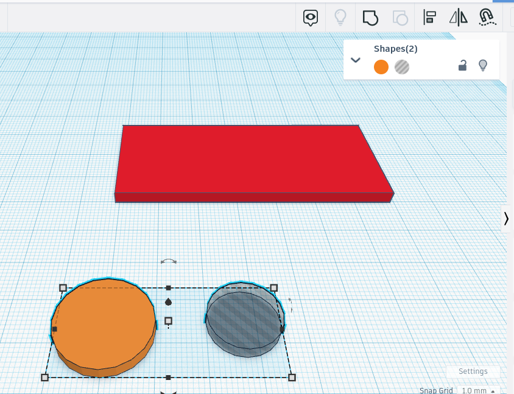
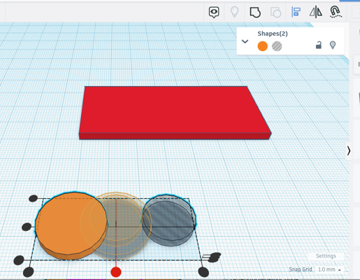
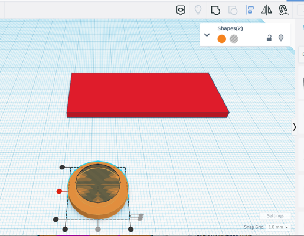
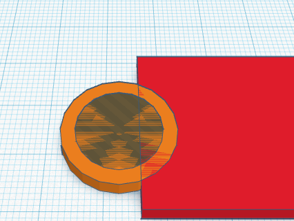
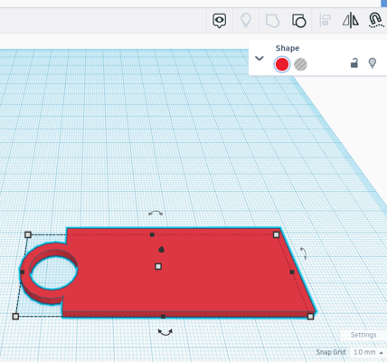

# Assignment 1: Lets Make a Nametag!

For our first assignment we will be using TinkerCAD to make a nametag. We will be taking the nametag that we make together and print them with a 3d printer. 

# 1) Sign In to Google Drive

Open Chrome

In the URL bar, type:

```
drive.google.com
```

Click Sign In 


\pagebreak

# 2) Find the "Class Code Tinkercad" file

Go to Shared with me

Find "Lets Print Robots" folder

Double Click to go into the folder

Find a file named "Class Code Tinkercad"

Open the file 

Click on the link to join the class

\pagebreak

# 3) Create your Tinkercad account

Click on the Google "G" 


\pagebreak

# 4) Create a new Design

On the Left side click on the "Designs" section

Click the "Create" button


Select 3d Design


\pagebreak

# 5) Set the name of the file

In the top left corner


Set the name to Your first name, Your Last name and the word "Nametag"


\pagebreak

# 6) Add the Base of the nametag

Add a box to the workplane. Cick on Bok on the right, and click on the blue workplane to place it.


Click on the white square in the corner, when you do, the numbers will show up. Click on the number and type the number it should be. 

Set it to 70mm by 30mm


Set the Height of the nametag base to 3mm


\pagebreak

# 7) Add a tab and a hole

Grab one Cylinder and one Cylinder Hole



Set the Hole dimension to 15mm by 15 mm



Set height of Tab and the hole to 3mm



\pagebreak

# 8) Allign the tab and hole

Highlight the tab and hole



Select the allign tool 


Allign In X



Allign In Y



Move the box after allignment



Select all and click the Group button


See that you have the base of a nametag




